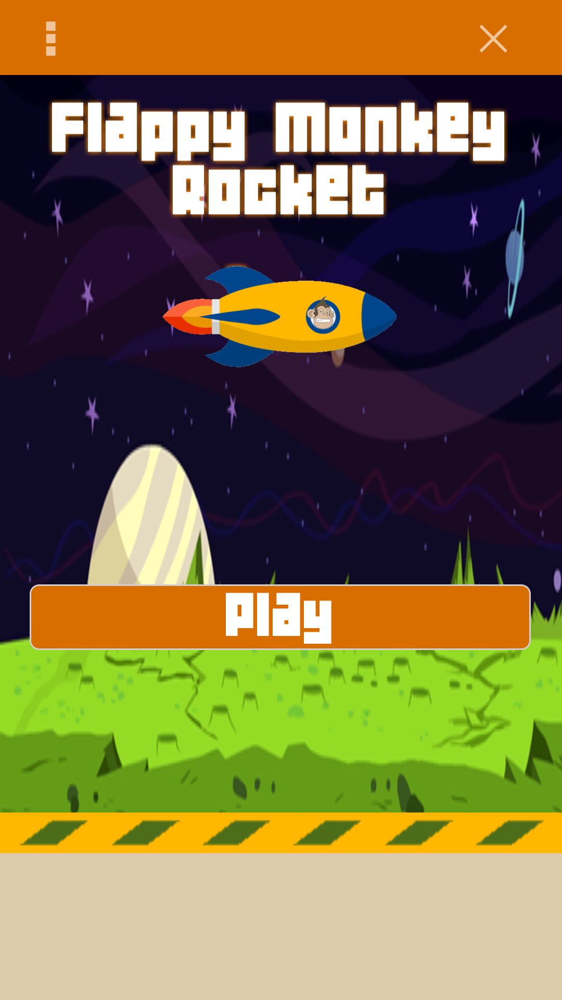

# FlappyMonkeyRocket

## Sobre

  * Jogo similar ao Flappy Bird, porém este foi desenvolvido em Delphi !!! (FireMonkey).
  
  * Compilado com Delphi 10 Seattle.
  
  * Contribua com melhorias e manutenção criando pull requests (https://github.com/marlonnardi/FlappyMonkeyRocket/pulls) e issues (https://github.com/marlonnardi/FlappyMonkeyRocket/issues).
  
  * Disponível na PlayStore (https://play.google.com/store/apps/details?id=br.com.falconsistemas.FlappyMonkeyRocket)

## Compilação

  * Não possui nenhuma dependência de componentes ;).

## Screenshots

  
  </a>

